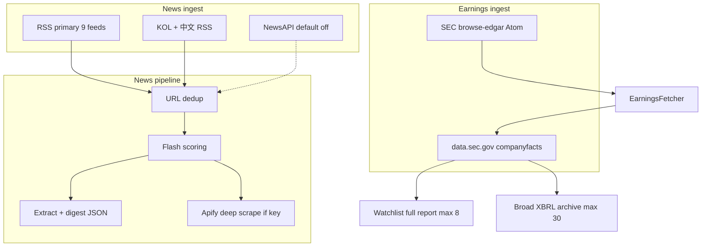

# 新聞與財報來源

以程式與 GHA workflow 為準。最後探測：**2026-08-15**（httpx + certifi，與 pipeline 相同）。

**設定來源**

- 新聞 RSS：[`sources/source_registry.yaml`](../sources/source_registry.yaml)（`type: news` 或未標 type）
- KOL／中文：[`sources/kol_registry.yaml`](../sources/kol_registry.yaml)
- 新聞取料：[`sources/rss_fetcher.py`](../sources/rss_fetcher.py)、[`sources/newsapi_fetcher.py`](../sources/newsapi_fetcher.py)
- 財報發現：同 registry 的 `type: earnings` 且 `enabled` + [`sources/earnings_fetcher.py`](../sources/earnings_fetcher.py)
- 財報數字：[`sources/sec_xbrl_fetcher.py`](../sources/sec_xbrl_fetcher.py)（SEC XBRL 為 actual 真值）
- Watchlist：[`config/earnings_watchlist.yaml`](../config/earnings_watchlist.yaml)
- 每日注入：[`.github/workflows/schedule.yml`](.github/workflows/schedule.yml)、[`.env.example`](../.env.example)

每日 `main.py` 兩條線分開：新聞走 RSS／KOL（NewsAPI 預設關）；財報走 SEC Atom → XBRL。Finnhub／FMP／NewsAPI／社群趨勢只在對應旗標開啟 **且**有 key 時才打。有 secret **不代表**已開。Vendor 維持 `off`（SEC-only）。

---

## 金鑰與開關（GHA 現況）

`schedule.yml` 注入 secrets（空值則該路 skip），並**明示** `NEWSAPI_ENABLED=0`、`SOCIAL_TRENDING_ENABLED=0`。未設 `EARNINGS_VENDOR_MODE`／`EARNINGS_FUNDAMENTAL_MODE`／`NEWS_TAKEAWAY_MODE` → 程式預設 `off`。

| 變數 | 角色 | GHA | 預設行為 |
|------|------|-----|----------|
| `OPENAI_API_KEY` | 抽取、打分、財報敘事 | 必填 | preflight 失敗 |
| `SEC_USER_AGENT` | EDGAR／XBRL／filing 正文 UA | 必填 | `sec_user_agent()` fallback |
| `NEWSAPI_KEY` | 科技頭條補充 | 注入 | 仍要 `NEWSAPI_ENABLED=1` |
| `APIFY_API_KEY` | deep 全文 | 注入 | trending 另要 `SOCIAL_TRENDING_ENABLED=1` |
| `FINNHUB_API_KEY` | vendor enrich；`grade_decisions` | 注入 | mode=`off` 不 enrich；grade 無 key 則 skip |
| `FMP_API_KEY` | 比率／現金流 | 注入 | mode=`off` 不補 |
| `FRED_API_KEY` | digest `macro_context` | 可選 | 宏觀區塊空 |

| 旗標 | 預設 | 作用 |
|------|------|------|
| `NEWSAPI_ENABLED` | `0` | `1` 才打 NewsAPI |
| `SOCIAL_TRENDING_ENABLED` | `0` | `1` 才打 Apify X／Threads 趨勢 |
| `EARNINGS_VENDOR_MODE` | `off` | `free`／`paid` 才跑 Finnhub enrich |
| `EARNINGS_FUNDAMENTAL_MODE` | `off` | `free`／`paid` 才跑 FMP enrich |
| `NEWS_TAKEAWAY_MODE` | `off` | `on` 才為新聞加 takeaway |
| `EXTRACTOR_FULLTEXT_TOP_K` | `0` | `>0` 才在抽取前用 Apify 補 Top-K 全文 |
| `EARNINGS_REPORTS_ENABLED` | `1`（GHA 設） | 寫 `dashboard/data/earnings/` |

啟用 vendor 見 [`VENDOR_ENABLEMENT.md`](VENDOR_ENABLEMENT.md)。財報 env 見 [`EARNINGS_ENV.md`](EARNINGS_ENV.md)。

---

## 新聞來源

[`RSSFetcher`](../sources/rss_fetcher.py) 只載入 `type == "news"`。每源最多 20 篇；RSS 免金鑰。

### RSS 主源（開）

備援鏈：TechCrunch → The Verge → Ars → Wired → The Register。

| name | 來源 | fallback |
|------|------|----------|
| `techcrunch_rss` | TechCrunch | `theverge_rss` |
| `theverge_rss` | The Verge | `ars_technica_rss` |
| `ars_technica_rss` | Ars Technica Technology Lab | `wired_rss` |
| `wired_rss` | Wired | `theregister_rss` |
| `theregister_rss` | The Register | — |
| `ieee_spectrum_rss` | IEEE Spectrum（`feeds/feed.rss`，舊 blog/fulltext 404） | — |
| `huggingface_blog_rss` | Hugging Face Blog | — |
| `openai_news_rss` | OpenAI News | — |
| `coindesk_rss` | CoinDesk（唯一加密新聞 RSS） | — |

### RSS 關（URL 留著方便重開）

| name | 原因 |
|------|------|
| `bloomberg_rss` | 常見封鎖／付費牆，備援已是 TechCrunch |
| `reuters_tech_rss` | 免費 RSS 不穩 |
| `decrypt_rss`／`theblock_rss` | 與 CoinDesk 重疊 |
| `anandtech_rss` | 站點實質停更 |
| `semianalysis_rss` | 與 KOL `semianalysis` 同 URL |

### KOL／長文

只抓 `connector: rss` 且 `enabled: true`。

**開**：Stratechery、Import AI、Pragmatic Engineer、Platformer、Lenny、Simon Willison、Latent Space、Interconnects、SemiAnalysis、High Scalability、arXiv cs.AI、arXiv cs.AR、IACR ePrint。

**關**：`a16z_blog`（舊 Future archive 停更）、`sequoia_blog`（Framer 站無 RSS，404）、`ethereum_crypto_research`（無 RSS）。

**中文開**：曼報（pipeline UA `tech-pulse/0.1` 可用；其他 UA 可能 403）、區塊勢。**關**：動區專欄（opinion feed 404，不改用全站快訊）、曲博（YouTube，無 connector）、SemiAnalysis 中文討論（manual）。

### 付費補充（預設關）

| 來源 | 旗標 | 行為 |
|------|------|------|
| NewsAPI | `NEWSAPI_ENABLED` | `top-headlines?category=technology&language=en`；與 RSS 依 URL 合併 |
| Apify trending | `SOCIAL_TRENDING_ENABLED` | X／Threads hashtag，只當評分訊號 |
| Apify 全文 | `APIFY_API_KEY` | deep brief 會呼叫；抽取前 Top-K 預設關 |

### 不是新聞源

- `NEWS_TAKEAWAY_MODE`：生成 takeaway，不取料。預設 `off`。
- FRED／供應鏈：digest `macro_context`。

---

## 財報來源

### 發現

| name | 狀態 | 說明 |
|------|------|------|
| `sec_edgar_earnings_rss` | 開 | browse-edgar Atom，最近 40 筆 8-K（2026-08-15 實測 200／可 parse） |
| `sec_edgar_rss` | 關 | EFTS `search-index` 回 JSON，fetcher 只 parse XML，實務 0 筆。URL 留著；`EarningsFetcher` 會跳過 `enabled: false` |

發現層目前只有 Atom。filing 正文與 XBRL 皆走 `SEC_USER_AGENT`（[`sec_document_headers`](../sources/earnings_fetcher.py)／[`sec_user_agent`](../sources/sec_client.py)）。後續若要提高 watchlist 命中，可改 `sec_submissions` 按 ticker 直查（尚未做）。

### 數字真值

| 步驟 | 模組 | 上限／宇宙 |
|------|------|------------|
| companyfacts | [`sec_xbrl_fetcher.py`](../sources/sec_xbrl_fetcher.py) | `MAX_SEC_API_CALLS_PER_RUN=60` |
| Ticker ↔ CIK | [`ticker_cik_map.py`](../sources/ticker_cik_map.py) | |
| Watchlist | [`config/earnings_watchlist.yaml`](../config/earnings_watchlist.yaml) | T1–T5，約 40 檔 |
| 完整管線 | watchlist 命中 | `MAX_EARNINGS_FILINGS=8` |
| 廣覆蓋歸檔 | 非 watchlist | `MAX_EARNINGS_FILINGS_BROAD=30` |

紅線：SEC XBRL 是 actual；Finnhub／FMP 只 enrichment。Vendor **維持 off**，不在 GHA 開 `EARNINGS_VENDOR_MODE=free`。

`grade_decisions.py` 另用 `FINNHUB_API_KEY` 算 forward return；無 key 時 best-effort 跳過。
